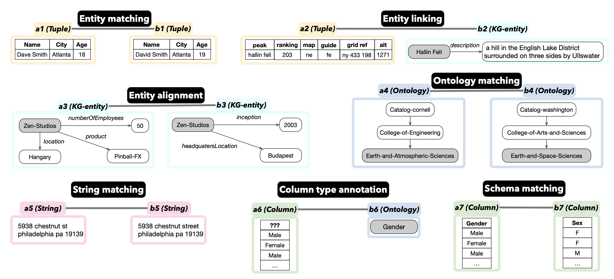
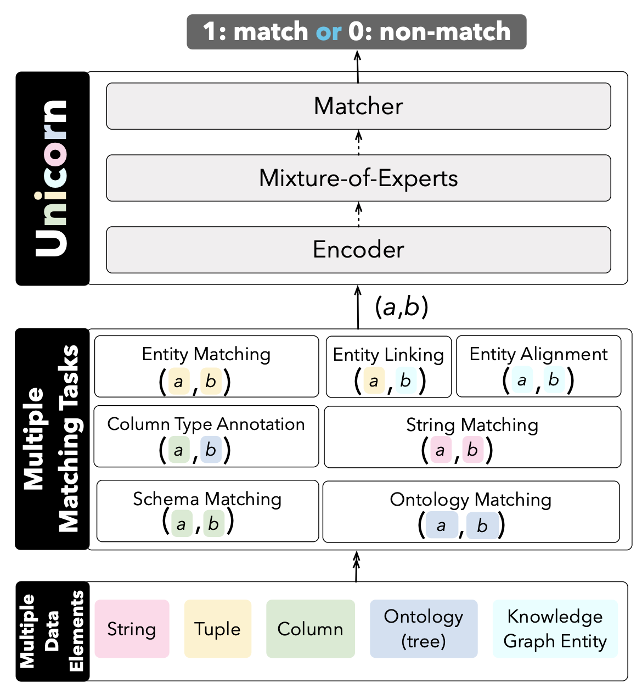

# Unicorn


This repository contains source code for the SIGMOD'2023 paper ["Unicorn: A Unified Multi-tasking Model for Supporting
Matching Tasks in Data Integration"](https://doi.org/10.1145/3588938). In this paper we introduce Unicorn, a unified model for generally supporting common data matching tasks. This unified model can enable knowledge sharing by learning from multiple tasks and multiple datasets, and can also support zero-shot prediction for new tasks with zero labeled matching/non-matching pairs. Unicorn employs one generic Encoder that converts any pair of data elements (a,b) into a learned representation, and uses a Matcher, which is a binary classifier, to decide whether (a,b) is matching. Unicorn adopts a mixture-of-experts (MoE) model that enhances the learned representation into a better representation, which can further boost the performance of predictions.




## Code Structure


```sh
|-- data # datasets for 20 matching tasks
|-- figs # figures
|-- main.py # pre-train Unicorn under unified prediction setting with the given 20 datasets (section 5.2 in paper)
|-- main-zero.py # pre-train Unicorn under zero-shot setting (section 5.3 in paper)
|-- main-zero-template.py # pre-train Unicorn under zero-shot setting with instruction template (section 5.3 in paper)
|-- finetune.py # fine-tune Unicorn with new dataset
|-- test.py # test new dataset with the pre-trained Unicorn
|-- unicorn # code for Unicorn
    |-- dataprocess # data processing folder
        |-- dataformat.py # dataset configuration
        |-- predata.py # data processing function
    |-- model # implementation of model
        |-- encoder.py # encoder module: convert serialized (a,b) into representation
        |-- moe.py # mixture-of-experts module: convert representation into a better representation
        |-- mather.py # matcher module: convert the representation into 0 (non-matching)/1 (matching)
    |-- traner # model learning function
        |-- pretrain.py # training model function
        |-- evaluate.py # evaluation function
    |-- utils # configuration files and tools
        |-- param.py # necessary parameter
        |-- utils.py # some auxiliary functions
```

## DataSets
We publish 20 datasets of 7 matching tasks in Unicorn.
Each dataset contains `train.json` / `valid.json` / `test.json`. The details can be found in our paper.

- Entity Matching
    - em-wa: Walmart-Amazon
    - em-ds: DBLP-Scholar
    - em-fz: Fodors-Zagats
    - em-ia: iTunes-Amazon
    - em-beer: Beer
- Column Type Annotation
    - efthymiou: Efthymiou
    - t2d_col_type_anno: T2D
    - Limaye_col_type_anno: Limaye
- Entity Linking
    - t2d: T2D
    - Limaye: Limaye
- String Matching
    - smurf-addr: Address
    - smurf-names: Names
    - smurf-res: Researchers
    - smurf-prod: Product
    - smurf-cit: Citation
- Schema Matching
    - fabricated_dataset: FabricatedDatasets
    - DeepMDatasets: DeepMDatasets
- Ontology Matching
    - Illinois-onm: Cornell-Washington
- Entity Alignment
    - dbp_yg: SRPRS: DBP-YG
    - dbp_wd: SRPRS: DBP-WD




## Quick Start
### Step 1: Requirements
- Before running the code, please make sure your Python version is 3.6.5 and cuda version is 11.1. Then install necessary packages by :
- `pip install -r requirements.txt`
- `pip install torch==1.7.1+cu110 torchvision==0.8.2+cu110 torchaudio==0.7.2 -f https://download.pytorch.org/whl/torch_stable.html`

### Step 2: Run

### Pre-train Unicorn with the given datasets
-  Run the script for Unicorn:
```bash
python main.py --pretrain --model deberta_base
```

- Run the script for Unicorn++:
```bash
python main.py --pretrain --model deberta_base --shuffle 1 --load_balance 1 --modelname UnicornPlus
```

- Run the script for Unicorn Zero-shot:
```bash
python main-zero.py --pretrain --model deberta_base
```

- Run the script for Unicorn Zero-shot instruction template:
```bash
python main-zero-template.py --pretrain --model deberta_base
```

After the pre-training, the `checkpoint` folder is generated and the three modules of the model are saved: `encoder.pt`, `moe.pt` and `cls.pt`. If you do not want to pre-train yourself, you can download our pre-trained model directly from [HuggingFace](https://huggingface.co/RUC-DataLab/unicorn-plus-v1), and save them in checkpoint folder.


### Finetune model with your dataset

```bash
python finetune.py --load --ckpt UnicornPlus --model deberta_base --train_dataset_path "train_file_path1.json train_file_path2.json ..." --valid_dataset_path "valid_file_path1.json valid_file_path2.json ..." --test_dataset_path "test_file_path1.json test_file_path2.json ..." --train_metrics "f1 f1 ..." --test_metrics "f1 f1 ..." --modelname UnicornPlusNew
```

- This script loads the pre-trained model `UnicornPlus`, and uses the training data represented by `--train_dataset_path` to finetune `UnicornPlus`, then outputs new model `UnicornPlusNew`.
- Note that `--train_dataset_path` is required, `--valid_dataset_path` and `--test_dataset_path` are optional.

### Load model and direct test

```bash
python test.py --load --ckpt UnicornPlus --model deberta_base --dataset_path "test_file_path1.json test_file_path2.json ..." --test_metrics "f1 f1 ..."
```
